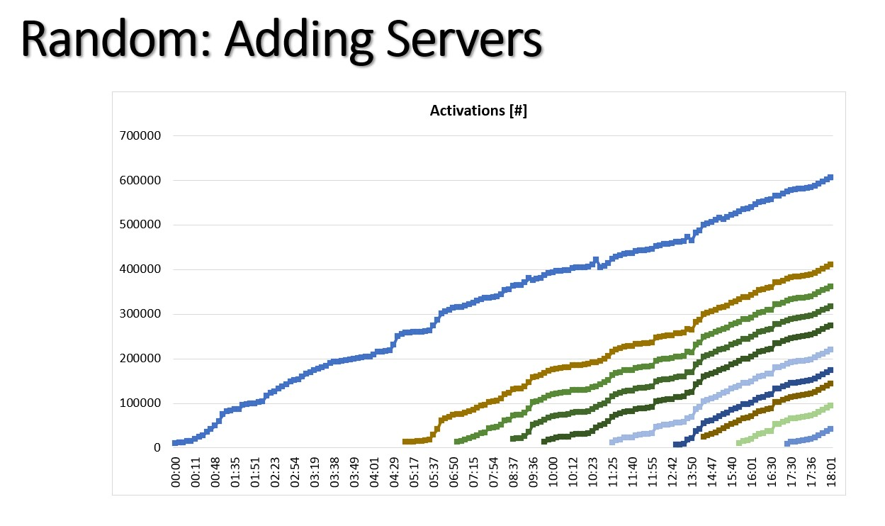
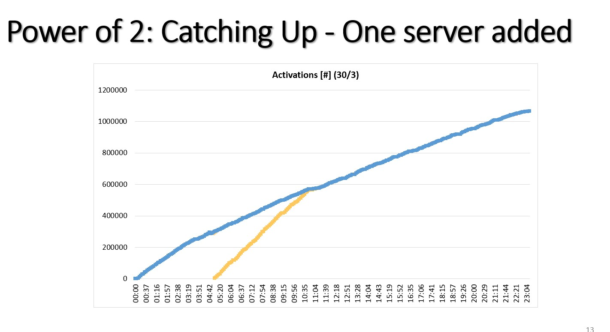

# Wednesday, January 19, 2022

## .NET Orleans on Kubernetes with auto scaling

Posted a [question](https://discord.com/channels/333727978460676096/922945034427432980/933527078521962558) on the Orleans Discord channel about an auto scaling problem:

<blockquote>
Hi all 👋 

I'm having an issue with Orleans 3.5.0 on k8s with auto scaling.

According to my understanding, once grains are placed on a silo and activated, they should not be moved to another silo unless there is a failure.
But this is not what we are observing. When the hpa increases the number of replicas from 1 to 2 (memory threshold of 750MB is reached), we see that sometimes a particular grain is immediately moved to the new pod.

We notice this because this grain state is in memory and therefore it's state is lost, causing an error.
Is there any mechanism that would cause a grain to be moved from one silo to another that I'm not aware of ? Thank you.
</blockquote>


## .NET Orleans grain placement strategy

[Documentation on load balancing on Orleans](https://dotnet.github.io/orleans/docs/implementation/load_balancing.html)

[PowerPoint presentation on Balancing Techniques in Orleans.](https://view.officeapps.live.com/op/view.aspx?src=https%3A%2F%2Fdotnet.github.io%2Forleans%2Fdocs%2Fresources%2Fpresentations%2FBalancing%2520Techniques%2520in%2520Orleans.pptx&wdOrigin=BROWSELINK) 

By default Orleans uses a random grain placement strategy. This strategy works well for a cluster with a fixed number of silos.

However, when hosted on Kubernetes with auto scaling, this strategy may not work well. New grains are placed randomly on all pods, leading to unbalanced use of memory  and/or CPU resources accross pods.

An alternative would be to use the more advanced `ActivationCountPlacement` that will try to equalize the number of activations on all silos by picking 2 servers at random and place the grain on the least loaded. See images below.

One question: When using Orleans streams, pulling agents are balanced on the silos. Do the place grains using the default placement strategy or do they use local placement?






## C# 9 Records and Init Only Setters

### Nuget packages targeting `netcoreapp3.1`

[This article](https://btburnett.com/csharp/2020/12/11/csharp-9-records-and-init-only-setters-without-dotnet5.html) explains some of the caveats of records and init only setters without .NET 5

It's possible to introduce records and init only setters in projects targeting `netcoreapp3.1`.
The language version must be explicitely set to 9.0 or above by setting the `<LangVersion>9.0</LangVersion>` element.
The compiler will look for a `IsExternalInit` class that only exist in .NET 5, but it can be manually added to the projet.

If the consumer of the package targets `netcoreapp3.1` and uses C# 8, it won't be able to create instances of classes with init only setters using the `new` keyword.
However, deserialization of json data to records using `Newtonsoft.Json` or `System.Text.Json` works just fine.

A simple fix for the package consumer is to upgrade language version to C# 9. 

### Hiding sensitive data

For records, the compiler automatically generates a `PrintMembers` method tht will format public properties names and values nicely when calling `ToString()`. It could however leak sensitive data into logs or exceptions so we have to keep that in mind.
There is no built-in way to exclude properties from `PrintMembers` and [this proposal](https://github.com/dotnet/csharplang/issues/3925) has been rejected.

This [Stack Overflow answer](https://stackoverflow.com/a/66016242/1130)  gives a nice and clean way to exclude sensitive data from `ToString()` output.

```csharp
public override string ToString()
{
    var builder = new StringBuilder();
    (this with { Password = null }).PrintMembers(builder);
    return builder.ToString();
}
```

