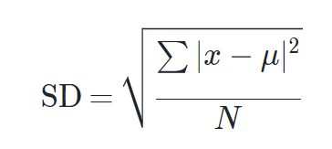

# Wednesday, March 9, 2022

## Introduction to Statistics

Week 3 of the Coursera Introduction to Statistics course

### Expected value and standard error for the sum

Population average: μ (mu)
Standard deviation: σ (sigma)

`E(Sn) = n * μ`
`SE(Sn) = sqrt(n) * σ`

Formula for standard deviation:

